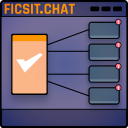
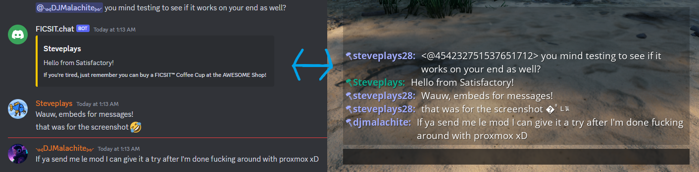

# FICSIT.chat

Satisfactory to Discord chat bridge mod with lots of configurability.

Image gallery

 

## Usage

1. Create a Discord bot on Discord's [developer portal](discord.com/developers) (make sure to copy the bot token as you will need it in the next few steps)
    - Example application name: `FicsitChat`
    - Example description: `Satisfactory to Discord chat bridge.`
    - Example bot username: `FICSIT.chat`
    - Example icon: [`assets\ficsit_chat_icon_512x512.png`](assets\ficsit_chat_icon_512x512.png)
2. Enable message content intent
3. Invite the bot to your server
4. Enter the bot token into FICSIT.chat's [configuration](#configuration)
5. Enable [developer mode in your Discord client](https://discord.com/developers/docs/game-sdk/store#application-test-mode)
6. Copy the ID of the channel (`Hover over channel->Right click->Copy Channel ID`) you want the bot to use to post Satisfactory messages and send Discord messages back to Satisfactory.
7. Enter the channel ID into FICSIT.chat's [configuration](#configuration)
8. Modify the other options in FICSIT.chat's [configuration](#configuration) to your heart's content

Have fun!

### Configuration

#### Client

See the in-game configuration screen (`Main Menu->Mods->FICSIT.chat`) for modifying the configuration.

#### Dedicated servers

Todo.

## Contributing

To report bugs/crashes, or give suggestions, head over to the repository's [issues tab](https://github.com/Steveplays28/FicsitChat/issues).  

## Development

- Satisfactory version: `Update 8`
- Satisfactory Mod Loader (SML) version: `3.5.0`

Visit the [Satisfactory modding documentation](https://docs.ficsit.app/satisfactory-modding/latest/Development/index.html) for information on how to set up the project for your IDE.

## License

This program is free software: you can redistribute it and/or modify
it under the terms of the GNU General Public License as published by
the Free Software Foundation, either version 3 of the License, or
(at your option) any later version.

This program is distributed in the hope that it will be useful,
but WITHOUT ANY WARRANTY; without even the implied warranty of
MERCHANTABILITY or FITNESS FOR A PARTICULAR PURPOSE.  See the
GNU General Public License for more details.

You should have received a [copy of the GNU General Public License](LICENSE)
along with this program.  If not, see <https://www.gnu.org/licenses/>.

## Attribution

Icon created by Drew (xXdrewbaccaXx).

## Contact info

If you want to say hi, head over to my [Discord server](https://discord.gg/KbWxgGg).  
Patreon: [steveplays28](https://patreon.com/steveplays28)  
